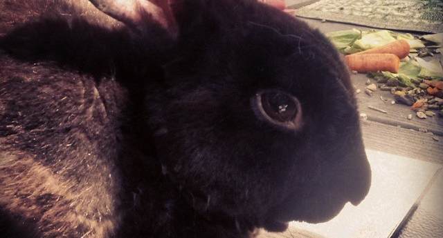

Martin.js is a JavaScript library for working with HTML5 canvas. Martin supports jQuery-like chained methods, and makes photo manipulation, drawing, and animation in browser easy for developers and users.

You can download Martin (latest: v0.3.2) here:

- [Full version, annotated (34 kb)](download/martin.js)
- [Minified (15 kb)](download/martin.min.js)

Or through Bower:

```js
bower install martinjs --save
```

\- Scottland / [@scottpdonaldson](https://twitter.com/scottpdonaldson)

<hr>

## Initializing

First, make sure you've included the source file, ideally in the `<head>` of the page, but always before you call `Martin`.

```html
<script src="path/to/martin.min.js"></script>
```

Set up a canvas like this:
```js
var canvas = Martin('el', options);
```

`el` can be the ID of an existing `<canvas>` or `` element, an element itself, or nothing (in which case you will work on a virtual/buffer canvas). If you include `options` , it must be an object with `key: value` pairs that describe how you want to instantiate.

<hr>

## Example

```html

```


We're going to take the original image, draw a white rectangle on it, write "Hello!" over the rectangle, and then desaturate it all by 100% -- turning it black and white.

```js
var canvas = Martin('image');

canvas.rect({
    x: 100,
    y: 200,
    width: 90,
    height: 50,
    color: '#fff'
});

canvas.text({
    text: 'Hello!',
    align: 'center',
    size: 18,
    x: 145,
    y: 215
});

canvas.desaturate(100);
```

<script>
var canvas = Martin('home-example');

canvas.rect({
    x: 100,
    y: 200,
    width: 90,
    height: 50,
    color: '#fff'
});

canvas.text({
    text: 'Hello!',
    align: 'center',
    size: 18,
    x: 145,
    y: 215
});

canvas.desaturate(100);
</script>
